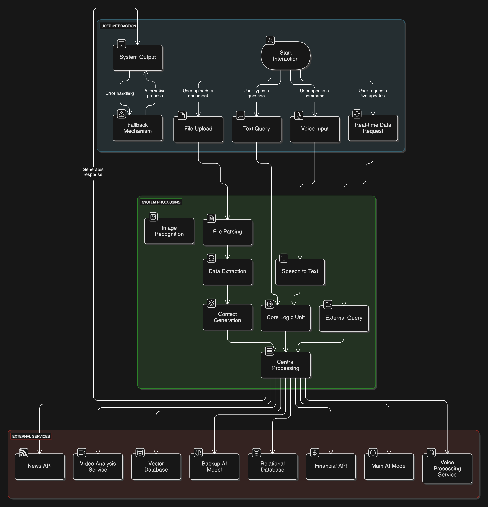

# FinBOT

FinBOT is a financial assistant chatbot designed to empower users with real-time financial insights, document-based query responses, and general financial guidance. It offers four distinct interaction modes—General Queries, Chat with PDF, Chat with Live Data, and Chat with Live Voice—to cater to a variety of user needs. 

Leveraging cutting-edge AI technologies, vector databases, and scalable cloud deployment solutions like Docker and Kubernetes, finBOT delivers a robust, reliable, and user-friendly experience.

## Features

- **Multiple Interaction Modes**: Seamlessly switch between general financial questions, PDF document analysis, live data retrieval, and voice-based interactions.
- **Real-Time Data Integration**: Connects to external APIs such as Yahoo Finance, NewsAPI, and CoinGecko for the latest financial data.
- **Document Querying**: Upload PDF documents and ask specific questions about their contents using advanced text extraction and semantic search.
- **Voice Capabilities**: Redirects to an external platform for hands-free, voice-driven financial queries.
- **Reliability Assurance**: Features a fallback mechanism to ensure uninterrupted service if the primary language model encounters issues.
- **Scalable Architecture**: Packaged in Docker containers and deployable on Kubernetes for high availability and scalability.

## Modes of Operation

### 1. General Queries

**Purpose:** Provide direct answers to general financial questions using a large language model (LLM).

#### How It Works:
1. **Input:** Users input a question (e.g., "What is diversification in investing?") through the Streamlit web interface.
2. **Processing:**
   - The query is sent to Google’s `gemini-2.0-flash-exp` LLM using functions from `tools/llm_chat_tool.py`.
   - The conversation history is maintained using `st.session_state.gemini_history`.
3. **Output:** The response is streamed back to the user in real-time.

**Example:**
```text
User Input: "What is diversification in investing?"
Response: "Diversification in investing refers to spreading your investments across various asset classes..."
```

### 2. Chat with PDF

**Purpose:** Allow users to upload a PDF document and ask questions about its contents.

#### How It Works:
1. **Input:** Users upload a PDF and submit a query (e.g., "What is the profit margin in this report?").
2. **Processing:**
   - Extracts text using `MarkItDown`.
   - Chunks text using `SemanticChunker`.
   - Converts chunks into vector embeddings using `SentenceTransformer` (`all-MiniLM-L6-v2`).
   - Stores embeddings in a **Qdrant** vector database.
   - Uses a **retriever agent** to fetch relevant document chunks and an LLM to synthesize a response.
3. **Output:** The response is displayed in the chat UI.

**Example:**
```text
User Input: "What is the profit margin in this report?"
Response: "The profit margin for Q2 2023 is 18.5%..."
```

### 3. Chat with Live Data

**Purpose:** Deliver real-time financial information from external APIs.

#### How It Works:
1. **Input:** Users enter a query (e.g., "What’s the latest Tesla stock price?").
2. **Processing:**
   - The retriever agent identifies the relevant data source.
   - Uses tools from `tools/api_tools.py` (e.g., YahooFinanceTool, NewsAPITool, CryptoAPITool).
   - Synthesizes a response using the LLM.
3. **Output:** The response is displayed with source attribution.

**Example:**
```text
User Input: "What’s the latest Tesla stock price?"
Response: "Source: Yahoo Finance\nData: Tesla (TSLA) stock price: $230.45"
```

### 4. Chat with Live Voice

**Purpose:** Enable hands-free, interactive financial queries through voice, camera, or screen-based interactions.

#### How It Works:
Users can select from three distinct interaction modes via the sidebar:

1. **Voice Chat (Hands-Free Financial Assistance)**
   - Allows users to interact with the chatbot purely through voice commands.
   - Get real-time financial updates, stock insights, investment tips, and market trends without using a keyboard.
   - Ideal for users seeking quick hands-free assistance.

   **Example:**
   ```text
   User: "Hey FinBOT, should I invest in Tesla right now?"
   Response (audio): "Tesla's stock is currently at $800 with a strong growth trajectory. Analysts suggest holding for long-term gains."
   ```

2. **Camera Chat (Visual Financial Analysis)**
   - Uses the webcam to recognize financial documents, receipts, invoices, or charts.
   - Processes the scanned image using Gemini multimodal and provides insights.
   - Ideal for scanning bills, bank statements, or investment reports for instant breakdowns.

   **Example:**
   ```text
   User shows an invoice with multiple expenses.
   FinBOT: "Your total spending for this month is $2,500. Would you like a breakdown of discretionary vs. essential expenses?"
   ```

3. **Screen Chat (Interactive Graph & Chart Analysis)**
   - Users can share their screen to show stock market graphs, financial reports, or data tables.
   - The chatbot, powered by Gemini multimodal, analyzes the visuals and provides context-aware insights.
   - Ideal for traders and analysts who need real-time data-driven suggestions.

   **Example:**
   ```text
   User shares a live stock market graph.
   FinBOT: "This chart indicates an upward trend in Apple’s stock. Would you like a comparative analysis against Microsoft?"
   ```

#### Processing:

- Voice and visual inputs are handled by an external platform at `http://localhost:3000`.
- Speech-to-text conversion processes voice inputs.
- Image and screen analysis are done using multimodal AI.
- The LLM generates responses in text and audio formats.
- Text-to-speech converts the response back into audio for seamless interaction.

With these three modes, FinBOT offers an intuitive and accessible way to analyze financial information dynamically.

[](https://github.com/Bhaswanth67/finBOT_live)  - https://github.com/Bhaswanth67/finBOT_live


## Fallback Mechanism

- **Primary LLM:** Google’s `gemini-2.0-flash-exp`
- **Fallback LLM:** Grok’s `llama-3.3-70b-versatile`
- **Timeout:** 5 seconds (default)

## Testing

Tests are located in `features/tests/test_api_tools.py` and use **pytest**.

Run tests:
```bash
pytest features/tests/test_api_tools.py
```

## Deployment

### Docker

**Build and Run:**
```bash
docker build -t finbot .
docker run -p 8501:8501 finbot
```

### Kubernetes

**Deploy:**
```bash
kubectl apply -f features/k8s_deployment.yaml
```

### Preview


### Flowchart


### Architecture Diagram



## Directory Structure

```text
FinBOT/
├── .streamlit/            # Streamlit settings
├── data/                  # Stored chat session metadata
├── features/
│   ├── tests/             # API tool unit tests
│   ├── Dockerfile         # Docker setup
│   ├── fallback.py        # Fallback LLM logic
│   ├── k8s_deployment.yaml # Kubernetes config
│   └── performance_monitor.py # Monitors response times
├── tools/
│   ├── api_tools.py       # Live data API tools
│   ├── llm_chat_tool.py   # LLM utilities
│   ├── multimodal_tool.py # Voice mode support
│   └── pdf_search_tool.py # PDF processing
├── app.py                 # Core Streamlit app
└── requirements.txt       # Dependencies
```

## Installation and Setup

Clone the repository:
```bash
git clone https://github.com/yourusername/finbot.git
cd finbot
```

Install dependencies:
```bash
pip install -r requirements.txt
```

Configure environment variables:
```text
GEMINI_API_KEY=your_gemini_api_key
NEWSAPI_KEY=your_newsapi_key
QDRANT_URL=your_qdrant_url
QDRANT_API_KEY=your_qdrant_api_key
SERPER_API_KEY=your_serper_api_key
GROQ_API_KEY=your_groq_api_key
```

Run the application:
```bash
streamlit run app.py
```

Access the interface at [http://localhost:8501](http://localhost:8501).

## **Q&A Section**

### 1. Why is the response time sometimes higher?  
**Answer:** The response time can be higher because FinBOT uses multiple external services:

- **LLM:** Google’s `gemini-2.0-flash-exp` for answering queries.
- **Embeddings:** `all-MiniLM-L6-v2` from Hugging Face for vectorization.
- **Vector Database:** Qdrant for storing and retrieving document embeddings.  

Since these services operate on free-tier plans, they may introduce latency due to rate limits, network congestion, or load balancing delays.

---

### 2. Why didn’t you integrate the Chat with Voice mode directly into Streamlit?  
**Answer:** The **Chat with Voice** mode requires camera access, screen sharing, and real-time voice processing. Streamlit does not natively support these features. Instead, I used an external frontend and backend tech stack to handle these functionalities. Additionally, WebSockets were integrated to enable real-time interactions between the user and FinBOT.
https://github.com/Bhaswanth67/finBOT_live

---

### 3. Why did you create four separate modes? What is the benefit of this approach?  
**Answer:**

- Each mode is optimized for specific user needs.
- **General Queries:** Best for text-based financial questions.
- **Chat with PDF:** Allows users to interact with financial documents.
- **Chat with Live Data:** Fetches real-time stock, crypto, and financial news updates.
- **Chat with Live Voice:** Offers hands-free interaction via voice and camera.  

This modular approach ensures a seamless user experience by selecting the best processing pipeline for each type of query.

---

### 4. You mentioned NewsAPI, Yahoo Finance, and other APIs. How does FinBOT decide which API to call?  
**Answer:** FinBOT uses a **retriever agent** that analyzes the query type and routes it to the appropriate API:

- If the query is about **stocks or financial markets**, it fetches data from **Yahoo Finance**.
- If the query relates to **cryptocurrencies**, it uses **CoinGecko**.
- If the query is about **financial news**, it retrieves data from **NewsAPI**.  

The decision-making is handled through **keyword detection** and **intent classification**.

---

### 5. What is the role of the retrieval and synthesizer agents in FinBOT?  
**Answer:**

- **Retriever Agent:** Searches relevant data from vector databases (Qdrant) or external APIs. It ensures that responses are contextually accurate by fetching only the most relevant chunks of information.
- **Synthesizer Agent:** Takes retrieved content and generates a coherent, well-structured response using the LLM. It ensures that the answer is meaningful and readable for the user.  

Together, these agents ensure that FinBOT delivers precise and high-quality financial insights.


## Contributing

1. Fork the repository.
2. Create a feature branch:
   ```bash
   git checkout -b feature-name
   ```
3. Commit your changes:
   ```bash
   git commit -m "Add feature description"
   ```
4. Push to your fork:
   ```bash
   git push origin feature-name
   ```
5. Submit a pull request.
